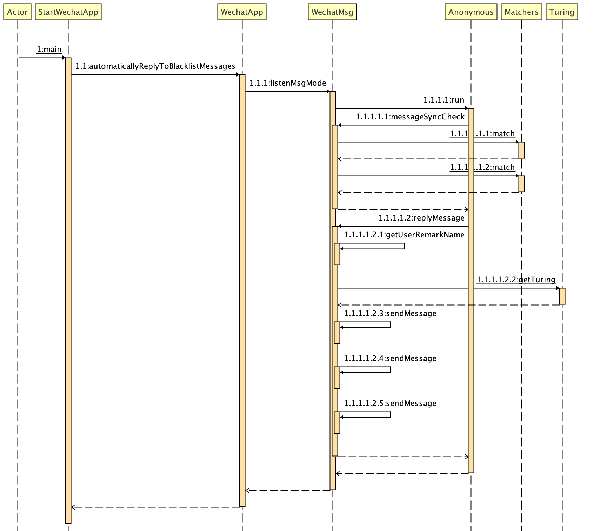

# 微信幽灵

「更新提示」 WeChatSpecter-1.1.2.jar （Bug修复版）已发布。

微信幽灵(WeChatSpecter)基于网页版微信实现了一套使用Java语言编写的消息管理机制。

### 快速上手

工具上手极其简单；如以下案例：

    package com.zhangyibin.wechat.wechatapp;
    public class StartWechatApp {
    /**
    * 启动微信幽灵程序
    * @author zhangyibin
    */
    public static void main(String[] args) {
        System.out.println("请设置黑名单好友(设置一组黑名单以逗号分割；例如：用户1,用户2,用户3)：");
        String partnerBlack = new Scanner(System.in).nextLine();
        String[] partnerBlackList = partnerBlack.split(",");
        System.out.println("黑名单好友列表如下：");
        for (String name : partnerBlackList) {
            System.out.println("--" + name);

        }
        System.out.println("设置默认回复消息？\n " +
                "1.设置：系统回复默认消息(可直接输入文字);\n " +
                "2.不设置：系统调用图灵机器人答复消息;");
        String message = new Scanner(System.in).nextLine();
        WechatApp wechatApp = WechatApp.getWechatApp();
        wechatApp.automaticallyReplyToBlacklistMessages(message, partnerBlackList);
    
        }
    }

上面的例子就是根据用户的休息场景对特定的好友名单实现了统一的消息回复机制。

### 实现机制

· 获取到uuid(通用唯一识别码)； 
· 基于uuid可成功获得微信登陆二维码； 
· 使用手机微信扫码登录； 
· 初始化消息和微信好友列表； 
· 启动微信消息监听机制； 
· 获得好友消息内容可实现消息回复； 

项目运行机制详情如下：

### API参考

点击查看：https://zhyblx.github.io/VersioningDemo/demo/index.html

### 版本更新

|版本号|下载链接|提取密码|发布日期|
|---|---|---|---|
|v1.1.2|https://pan.baidu.com/s/1Vkfus4UB-93UJMdJVhpq2w|mzrq|2021年7月20日|
|v1.1.1|https://pan.baidu.com/s/16lfacOMzL6mo8Bp7P_ILyw|zb53|2021年6月29日|
|v1.1.0|https://pan.baidu.com/s/1GCiSX23vh6mzTuyJC77FHA|2ccf|2021年6月22日|
|v1.0.2|https://pan.baidu.com/s/1PDkvA7PsRbSjd7D7svHGvw|6ym2|2021年6月21日|
|v1.0.1|https://pan.baidu.com/s/15MBGWfBlrbwsrsoZB14YEA|q2bv|2021年6月19日|
|v1.0|https://pan.baidu.com/s/1YPzATHWj8ZNtJhNGDo2rpQ|7c6w|2021年6月13日|

* 此项目我会持续（不定时）的进行更新，也请喜欢的同学长期关注。

### 免责声明

本项目不建议应用于任何商业场景，如果因使用本工具的能力从而触犯了国家的相关法律法规后果需自行承担。

